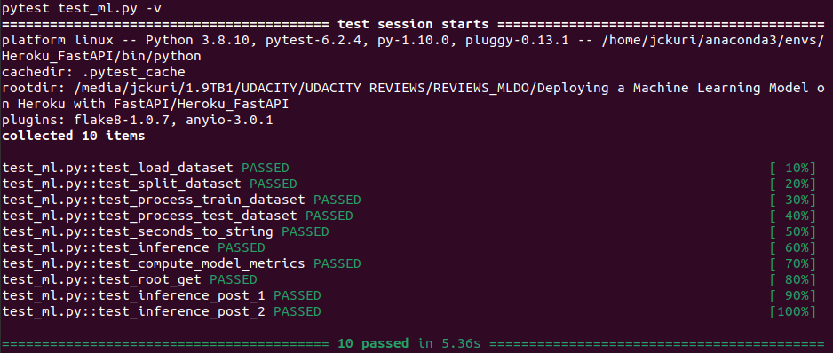

[](https://github.com/jckuri/Heroku_FastAPI/actions/workflows/python-app.yml)

# Deploying a Machine Learning Model on Heroku with FastAPI

**Machine Learning DevOps Engineer Nanodegree<br/>
https://classroom.udacity.com/nanodegrees/nd0821**

### The API must implement GET and POST. GET must be on the root domain and give a greeting and POST on a different path that does model inference.

```
@app.get("/")
def read_root():
    return "Hello world"
```

```
@app.post('/predict_salary')
async def predict_salary(person: Person = get_examples_of_persons()):
    x = mf.person_to_numpy(person)
    print("\nx:\n", x)
    pred = mf.model.predict(x)
    print('\npred:\n', type(pred), pred.shape, pred)
    return int(pred[0])
```

### Use Python type hints such that FastAPI creates the automatic documentation.

```
class Person(pydantic.BaseModel):
    age: int
    workclass: str
    fnlgt: str
    education: str
    education_num: int
    marital_status: str
    occupation: str
    relationship: str
    race: str
    sex: str
    capital_gain: int
    capital_loss: int
    hours_per_week: int
    native_country: str
```


### Use a Pydantic model to ingest the body of the POST. This should implement an example (hint: Pydantic/FastAPI provides multiple ways to do this, see the docs for more information: https://fastapi.tiangolo.com/tutorial/schema-extra-example/).

```
def get_person_1():
    desc = "Person 1. Her predicted salary should be 0, " \
        "which means she earns less than $50K."
    return {
        "summary": "Person 1",
        "description": desc,
        "value": {
            'age': 27,
            'workclass': 'Private', 
            'fnlgt': 160178,
            'education': 'Some-college', 
            'education_num': 10,
            'marital_status': 'Divorced', 
            'occupation': 'Adm-clerical',
            'relationship': 'Not-in-family', 
            'race': 'White', 
            'sex': 'Female',
            'capital_gain': 0, 
            'capital_loss': 0, 
            'hours_per_week': 38,
            'native_country': 'United-States'
        }
    }
    

def get_person_2():
    desc = "Person 2. His predicted salary should be 1, " \
        "which means he earns more than $50K."
    return {
        "summary": "Person 2",
        "description": desc,    
        "value": {
            'age': 29,
            'workclass': 'Private',
            'fnlgt': 185908,
            'education': 'Bachelors',
            'education_num': 13,
            'marital_status': 'Married-civ-spouse',
            'occupation': 'Exec-managerial',
            'relationship': 'Husband',
            'race': 'Black',
            'sex': 'Male',
            'capital_gain': 0,
            'capital_loss': 0,
            'hours_per_week': 55,
            'native_country': 'United-States'
        }
    }


def get_examples_of_persons():
    two_examples = {
        "person1": get_person_1(),
        "person2": get_person_2()
    } 
    return fastapi.Body(..., examples = two_examples)


@app.post('/predict_salary')
async def predict_salary(person: Person = get_examples_of_persons()):
    x = mf.person_to_numpy(person)
    print("\nx:\n", x)
    pred = mf.model.predict(x)
    print('\npred:\n', type(pred), pred.shape, pred)
    return int(pred[0])
```

### Include a screenshot of the docs that shows the example and name it example.png.

example.png


example2.png


However, the examples only appear locally in the address: <br/>
http://127.0.0.1:8000/docs<br/>
When you run the script `sh start-rest-api-locally.sh`.<br/>
You can test it!

**Note:** For some unknown reason, the examples never appear in the
Heroku website: <br/>
https://udacity-salary-predictor.herokuapp.com/docs

# Quick Review

### Model Card

You can read the Model Card in this link:<br/>
[starter/Model_Card.md](starter/Model_Card.md)

### Run the unit test test_ml.py:

```
pytest test_ml.py -v
========================================= test session starts =========================================
platform linux -- Python 3.8.10, pytest-6.2.4, py-1.10.0, pluggy-0.13.1 -- /home/jckuri/anaconda3/envs/Heroku_FastAPI/bin/python
cachedir: .pytest_cache
rootdir: /media/jckuri/1.9TB1/UDACITY/UDACITY REVIEWS/REVIEWS_MLDO/Deploying a Machine Learning Model on Heroku with FastAPI/Heroku_FastAPI
plugins: flake8-1.0.7, anyio-3.0.1
collected 10 items                                                                                    

test_ml.py::test_load_dataset PASSED                                                            [ 10%]
test_ml.py::test_split_dataset PASSED                                                           [ 20%]
test_ml.py::test_process_train_dataset PASSED                                                   [ 30%]
test_ml.py::test_process_test_dataset PASSED                                                    [ 40%]
test_ml.py::test_seconds_to_string PASSED                                                       [ 50%]
test_ml.py::test_inference PASSED                                                               [ 60%]
test_ml.py::test_compute_model_metrics PASSED                                                   [ 70%]
test_ml.py::test_root_get PASSED                                                                [ 80%]
test_ml.py::test_inference_post_1 PASSED                                                        [ 90%]
test_ml.py::test_inference_post_2 PASSED                                                        [100%]
```



### Deployed microservices

You can visit the link https://udacity-salary-predictor.herokuapp.com/
in which you will receive the contents of the GET implemented on the root domain.
In other words, this website will return a greeting message: Hello world.

live_get.png<br/>


You can visit the link https://udacity-salary-predictor.herokuapp.com/docs
in which the web app is deployed.

You can test the POST `/predict_salary` with the following request body:

```
{
"age":29, 
"workclass":"Private", 
"fnlgt":185908, 
"education":"Bachelors", 
"education_num":13, 
"marital_status":"Married-civ-spouse", 
"occupation":"Exec-managerial", 
"relationship":"Husband", 
"race":"Black", 
"sex":"Male", 
"capital_gain":0, 
"capital_loss":0, 
"hours_per_week":55, 
"native_country":"United-States"
}
```

And the result will be `1`, which means the person earns more than $50K:

example.png<br/>


You can also test the POST `/predict_salary` with another person:

```
{
"age":27, 
"workclass":"Private", 
"fnlgt":160178, 
"education":"Some-college", 
"education_num":10, 
"marital_status":"Divorced", 
"occupation":"Adm-clerical", 
"relationship":"Not-in-family", 
"race":"White", 
"sex":"Female", 
"capital_gain":0, 
"capital_loss":0, 
"hours_per_week":38, 
"native_country":"United-States"
}
```

The result should be `0`, which means the person earns less than $50K:

<!--
### Continuous Delivery Enabled via GitHub Actions

Continuous Delivery was enabled with GitHub Actions:

continuous_deloyment.png<br/>

-->

### Continuous Integration

Set up git with GitHub Actions.
	
* GitHub action should run pytest and flake8 on push to main/master.
* PyTest must pass (by time the project is done there should be at least three tests) and flake8 must pass without errors.
* Include a screenshot of the CI passing called `continuous_integration.png`.

continuous_integration.png<br/>


### dvc dag

Type this command to see the model files tracked by DVC: 

```
dvc dag
```

dvcdag.png<br/>


### POSTs to the API

**The rubric asked:** "Write a script that POSTS to the API using the requests 
module and returns both the result of model inference and the status code. 
Include a screenshot of the result. Name this live_post.png."

```
$ python remote_function_calls.py 
/home/jckuri/.local/lib/python3.8/site-packages/requests/__init__.py:89: RequestsDependencyWarning: urllib3 (1.26.4) or chardet (4.0.0) doesn't match a supported version!
  warnings.warn("urllib3 ({}) or chardet ({}) doesn't match a supported "

GET /
Status code: 200 OK
Result: "Hello world"

POST /predict_salary
Input data: {"age": 27, "workclass": "Private", "fnlgt": "160178", "education": "Some-college", "education_num": 10, "marital_status": "Divorced", "occupation": "Adm-clerical", "relationship": "Not-in-family", "race": "White", "sex": "Female", "capital_gain": 0, "capital_loss": 0, "hours_per_week": 38, "native_country": "United-States"}
Status code: 200 OK
Result: 0

POST /predict_salary
Input data: {"age": 29, "workclass": "Private", "fnlgt": "185908", "education": "Bachelors", "education_num": 13, "marital_status": "Married-civ-spouse", "occupation": "Exec-managerial", "relationship": "Husband", "race": "Black", "sex": "Male", "capital_gain": 0, "capital_loss": 0, "hours_per_week": 55, "native_country": "United-States"}
Status code: 200 OK
Result: 1
```

live_post.png<br/>


### Tests via pytest

```
$ pytest test_functions.py --disable-warnings
============================= test session starts ==============================
platform linux -- Python 3.8.10, pytest-6.2.4, py-1.10.0, pluggy-0.13.1
rootdir: /media/jckuri/1.9TB/UDACITY/UDACITY REVIEWS/REVIEWS_MLDO/Deploying a Machine Learning Model on Heroku with FastAPI/Heroku_FastAPI
plugins: flake8-1.0.7, anyio-3.0.1
collected 10 items                                                             

test_functions.py ..........                                             [100%]

======================== 10 passed, 1 warning in 6.36s =========================
```

### Tests via curl

The easiest way to test this web app is through the curl command. 
Here is the contents of the script `test_remote_rest_api.sh` to test this web app:

```
echo "Testing GET:"
curl -X GET "$1"

#       age         workclass   fnlgt     education  education-num      marital-status         occupation   relationship   race     sex  capital-gain  capital-loss  hours-per-week native-country salary
#14160   27           Private  160178  Some-college             10            Divorced       Adm-clerical  Not-in-family  White  Female             0             0              38  United-States  <=50K   
#28868   29           Private  185908     Bachelors             13  Married-civ-spouse    Exec-managerial        Husband  Black    Male             0             0              55  United-States   >50K 

echo "\nResult of POST 1: "
curl -X POST "$1/predict_salary" -H "accept: application/json" -H "Content-Type: application/json" -d "{\"age\":27, \"workclass\":\"Private\", \"fnlgt\":160178, \"education\":\"Some-college\", \"education_num\":10, \"marital_status\":\"Divorced\", \"occupation\":\"Adm-clerical\", \"relationship\":\"Not-in-family\", \"race\":\"White\", \"sex\":\"Female\", \"capital_gain\":0, \"capital_loss\":0, \"hours_per_week\":38, \"native_country\":\"United-States\"}"

echo "\nResult of POST 2: "
curl -X POST "$1/predict_salary" -H "accept: application/json" -H "Content-Type: application/json" -d "{\"age\":29, \"workclass\":\"Private\", \"fnlgt\":185908, \"education\":\"Bachelors\", \"education_num\":13, \"marital_status\":\"Married-civ-spouse\", \"occupation\":\"Exec-managerial\", \"relationship\":\"Husband\", \"race\":\"Black\", \"sex\":\"Male\", \"capital_gain\":0, \"capital_loss\":0, \"hours_per_week\":55, \"native_country\":\"United-States\"}"

echo ""
```

Execute the following command and you will get:

```
$ sh test_remote_rest_api.sh https://udacity-salary-predictor.herokuapp.com
Testing GET:
"Hello world"
Result of POST 1: 
0
Result of POST 2: 
1
```

What does it mean?
It means that you are calling the GET `/` and the result is a greeting: `"Hello world"`<br/>
You are also calling the POST `/predict_salary` twice by passing
2 registers of the dataset:

```
# REGISTER 1:
#       age         workclass   fnlgt     education  education-num      marital-status         occupation   relationship   race     sex  capital-gain  capital-loss  hours-per-week native-country salary
#14160   27           Private  160178  Some-college             10            Divorced       Adm-clerical  Not-in-family  White  Female             0             0              38  United-States  <=50K   
```

```
# REGISTER 2:
#       age         workclass   fnlgt     education  education-num      marital-status         occupation   relationship   race     sex  capital-gain  capital-loss  hours-per-week native-country salary
#28868   29           Private  185908     Bachelors             13  Married-civ-spouse    Exec-managerial        Husband  Black    Male             0             0              55  United-States   >50K 
```

`Result of POST 1` is `0` which means the predicted salary is `<=50K`.<br/>
`Result of POST 2` is `1` which means the predicted salary is `>50K`.<br/>
Both predictions are correct because they coincide with the salaries of register 1 and register 2.

### Testing REST API locally

Execute the following command to start the web services locally:

```
$ sh start-rest-api-locally.sh 
INFO:     Uvicorn running on http://127.0.0.1:8000 (Press CTRL+C to quit)
INFO:     Started reloader process [30935] using watchgod
INFO:     Started server process [30937]
INFO:     Waiting for application startup.
INFO:     Application startup complete.
```

Here is the contents of the script `start-rest-api-locally.sh`:

```
$ cat start-rest-api-locally.sh 
uvicorn main:app --reload
```

Once the web services are up locally, you can run:

```
$ sh test_remote_rest_api.sh http://127.0.0.1:8000
Testing GET:
"Hello world"
Result of POST 1: 
0
Result of POST 2: 
1
```

### Train model

The script `train_model.sh` executes the Python script `train_model.py`.
Here is the contents of the script `train_model.sh`:

```
$ cat train_model.sh 
python starter/starter/train_model.py
```

```
$ sh train_model.sh 

Whole dataset (32561, 15):
   age         workclass   fnlgt  education  education-num      marital-status         occupation   relationship   race     sex  capital-gain  capital-loss  hours-per-week native-country salary
0   39         State-gov   77516  Bachelors             13       Never-married       Adm-clerical  Not-in-family  White    Male          2174             0              40  United-States  <=50K
1   50  Self-emp-not-inc   83311  Bachelors             13  Married-civ-spouse    Exec-managerial        Husband  White    Male             0             0              13  United-States  <=50K
2   38           Private  215646    HS-grad              9            Divorced  Handlers-cleaners  Not-in-family  White    Male             0             0              40  United-States  <=50K
3   53           Private  234721       11th              7  Married-civ-spouse  Handlers-cleaners        Husband  Black    Male             0             0              40  United-States  <=50K
4   28           Private  338409  Bachelors             13  Married-civ-spouse     Prof-specialty           Wife  Black  Female             0             0              40           Cuba  <=50K

Train dataset (26048, 15):
       age         workclass   fnlgt     education  education-num      marital-status       occupation   relationship   race     sex  capital-gain  capital-loss  hours-per-week native-country salary
5514    33         Local-gov  198183     Bachelors             13       Never-married   Prof-specialty  Not-in-family  White  Female             0             0              50  United-States   >50K
19777   36           Private   86459     Assoc-voc             11  Married-civ-spouse  Exec-managerial        Husband  White    Male             0          1887              50  United-States   >50K
10781   58  Self-emp-not-inc  203039           9th              5           Separated     Craft-repair  Not-in-family  White    Male             0             0              40  United-States  <=50K
32240   21           Private  180190     Assoc-voc             11  Married-civ-spouse  Farming-fishing        Husband  White    Male             0             0              46  United-States  <=50K
9876    27           Private  279872  Some-college             10            Divorced    Other-service  Not-in-family  White    Male             0             0              40  United-States  <=50K

Test dataset (6513, 15):
       age         workclass   fnlgt     education  education-num      marital-status         occupation   relationship   race     sex  capital-gain  capital-loss  hours-per-week native-country salary
14160   27           Private  160178  Some-college             10            Divorced       Adm-clerical  Not-in-family  White  Female             0             0              38  United-States  <=50K
27048   45         State-gov   50567       HS-grad              9  Married-civ-spouse    Exec-managerial           Wife  White  Female             0             0              40  United-States  <=50K
28868   29           Private  185908     Bachelors             13  Married-civ-spouse    Exec-managerial        Husband  Black    Male             0             0              55  United-States   >50K
5667    30           Private  190040     Bachelors             13       Never-married  Machine-op-inspct  Not-in-family  White  Female             0             0              40  United-States  <=50K
7827    29  Self-emp-not-inc  189346  Some-college             10            Divorced       Craft-repair  Not-in-family  White    Male          2202             0              50  United-States  <=50K
Saving encoder:
 OneHotEncoder(handle_unknown='ignore', sparse=False)
Saving lb:
 LabelBinarizer()
X_train.shape=(26048, 108)
y_train.shape=(26048,)
X_test.shape=(6513, 108)
y_test.shape=(6513,)

Training model...
Fitting 5 folds for each of 8 candidates, totalling 40 fits
[CV 1/5] END criterion=gini, max_depth=25, max_features=auto, n_estimators=200;, score=0.851 total time=   5.5s
[CV 2/5] END criterion=gini, max_depth=25, max_features=auto, n_estimators=200;, score=0.857 total time=   5.3s
[CV 3/5] END criterion=gini, max_depth=25, max_features=auto, n_estimators=200;, score=0.859 total time=   5.3s
[CV 4/5] END criterion=gini, max_depth=25, max_features=auto, n_estimators=200;, score=0.864 total time=   5.3s
[CV 5/5] END criterion=gini, max_depth=25, max_features=auto, n_estimators=200;, score=0.866 total time=   5.2s
[CV 1/5] END criterion=gini, max_depth=25, max_features=auto, n_estimators=500;, score=0.852 total time=  13.6s
[CV 2/5] END criterion=gini, max_depth=25, max_features=auto, n_estimators=500;, score=0.858 total time=  13.4s
[CV 3/5] END criterion=gini, max_depth=25, max_features=auto, n_estimators=500;, score=0.858 total time=  13.5s
[CV 4/5] END criterion=gini, max_depth=25, max_features=auto, n_estimators=500;, score=0.865 total time=  13.5s
[CV 5/5] END criterion=gini, max_depth=25, max_features=auto, n_estimators=500;, score=0.867 total time=  14.1s
[CV 1/5] END criterion=gini, max_depth=100, max_features=auto, n_estimators=200;, score=0.845 total time=   6.3s
[CV 2/5] END criterion=gini, max_depth=100, max_features=auto, n_estimators=200;, score=0.850 total time=   6.1s
[CV 3/5] END criterion=gini, max_depth=100, max_features=auto, n_estimators=200;, score=0.850 total time=   5.9s
[CV 4/5] END criterion=gini, max_depth=100, max_features=auto, n_estimators=200;, score=0.859 total time=   6.4s
[CV 5/5] END criterion=gini, max_depth=100, max_features=auto, n_estimators=200;, score=0.860 total time=   6.4s
[CV 1/5] END criterion=gini, max_depth=100, max_features=auto, n_estimators=500;, score=0.845 total time=  16.0s
[CV 2/5] END criterion=gini, max_depth=100, max_features=auto, n_estimators=500;, score=0.851 total time=  15.9s
[CV 3/5] END criterion=gini, max_depth=100, max_features=auto, n_estimators=500;, score=0.851 total time=  15.1s
[CV 4/5] END criterion=gini, max_depth=100, max_features=auto, n_estimators=500;, score=0.858 total time=  15.1s
[CV 5/5] END criterion=gini, max_depth=100, max_features=auto, n_estimators=500;, score=0.861 total time=  15.0s
[CV 1/5] END criterion=entropy, max_depth=25, max_features=auto, n_estimators=200;, score=0.853 total time=   6.1s
[CV 2/5] END criterion=entropy, max_depth=25, max_features=auto, n_estimators=200;, score=0.858 total time=   6.1s
[CV 3/5] END criterion=entropy, max_depth=25, max_features=auto, n_estimators=200;, score=0.858 total time=   6.2s
[CV 4/5] END criterion=entropy, max_depth=25, max_features=auto, n_estimators=200;, score=0.867 total time=   6.2s
[CV 5/5] END criterion=entropy, max_depth=25, max_features=auto, n_estimators=200;, score=0.868 total time=   6.0s
[CV 1/5] END criterion=entropy, max_depth=25, max_features=auto, n_estimators=500;, score=0.852 total time=  15.2s
[CV 2/5] END criterion=entropy, max_depth=25, max_features=auto, n_estimators=500;, score=0.860 total time=  15.2s
[CV 3/5] END criterion=entropy, max_depth=25, max_features=auto, n_estimators=500;, score=0.859 total time=  15.4s
[CV 4/5] END criterion=entropy, max_depth=25, max_features=auto, n_estimators=500;, score=0.868 total time=  15.3s
[CV 5/5] END criterion=entropy, max_depth=25, max_features=auto, n_estimators=500;, score=0.868 total time=  15.0s
[CV 1/5] END criterion=entropy, max_depth=100, max_features=auto, n_estimators=200;, score=0.843 total time=   7.0s
[CV 2/5] END criterion=entropy, max_depth=100, max_features=auto, n_estimators=200;, score=0.853 total time=   7.0s
[CV 3/5] END criterion=entropy, max_depth=100, max_features=auto, n_estimators=200;, score=0.853 total time=   7.1s
[CV 4/5] END criterion=entropy, max_depth=100, max_features=auto, n_estimators=200;, score=0.859 total time=   7.1s
[CV 5/5] END criterion=entropy, max_depth=100, max_features=auto, n_estimators=200;, score=0.860 total time=   7.0s
[CV 1/5] END criterion=entropy, max_depth=100, max_features=auto, n_estimators=500;, score=0.845 total time=  17.7s
[CV 2/5] END criterion=entropy, max_depth=100, max_features=auto, n_estimators=500;, score=0.855 total time=  17.5s
[CV 3/5] END criterion=entropy, max_depth=100, max_features=auto, n_estimators=500;, score=0.852 total time=  17.7s
[CV 4/5] END criterion=entropy, max_depth=100, max_features=auto, n_estimators=500;, score=0.859 total time=  17.7s
[CV 5/5] END criterion=entropy, max_depth=100, max_features=auto, n_estimators=500;, score=0.861 total time=  17.7s
The model was trained in 7 minutes 33.25 seconds.

precision=0.7811745776347546
recall=0.6180776575429663
fbeta=0.6901208244491827
f1_score=0.6901208244491827

young_people.shape (5211, 15)
old_people.shape (1302, 15)
young_people + old_people: 6513 

men.shape (4387, 15)
women.shape (2126, 15)
men + women: 6513 

young_men.shape (3462, 15)
young_women.shape (1749, 15)
old_men.shape (925, 15)
old_women.shape (377, 15)
young_men + young_women + old_men + old_women: 6513 

ALL: test_dataset.shape (6513, 15)

SLICE			PRECISION	RECALL		F-BETA		F1-SCORE
Young Men		0.7875		0.6408		0.7066		0.7066
Young Women		0.7559		0.5026		0.6038		0.6038
Old Men			0.7848		0.6371		0.7033		0.7033
Old Women		0.6786		0.4524		0.5429		0.5429
Young			0.7831		0.6180		0.6908		0.6908
Old			0.7758		0.6184		0.6882		0.6882
Men			0.7868		0.6398		0.7057		0.7057
Women			0.7419		0.4936		0.5928		0.5928
Test Dataset		0.7812		0.6181		0.6901		0.6901

```

--------------------------------------------------------------------------------

# End of Quick Review

--------------------------------------------------------------------------------

# Environment Set up

Working in a command line environment is recommended for ease of use with git and dvc. If on Windows, WSL1 or 2 is recommended.

* Download and install conda if you don’t have it already.
    * Use the supplied requirements file to create a new environment, or
    * conda create -n [envname] "python=3.8" scikit-learn dvc pandas numpy pytest jupyter jupyterlab fastapi uvicorn -c conda-forge
    * Install git either through conda (“conda install git”) or through your CLI, e.g. sudo apt-get git.

## Repositories
* Create a directory for the project and initialize git and dvc.
    * As you work on the code, continually commit changes. Generated models you want to keep must be committed to dvc.
* Connect your local git repo to GitHub.
* Setup GitHub Actions on your repo. You can use one of the pre-made GitHub Actions if at a minimum it runs pytest and flake8 on push and requires both to pass without error.
    * Make sure you set up the GitHub Action to have the same version of Python as you used in development.
* Set up a remote repository for dvc.

# Data
* Download census.csv and commit it to dvc.
* This data is messy, try to open it in pandas and see what you get.
* To clean it, use your favorite text editor to remove all spaces.
* Commit this modified data to dvc (we often want to keep the raw data untouched but then can keep updating the cooked version).

# Model
* Using the starter code, write a machine learning model that trains on the clean data and saves the model. Complete any function that has been started.
* Write unit tests for at least 3 functions in the model code.
* Write a function that outputs the performance of the model on slices of the data.
    * Suggestion: for simplicity, the function can just output the performance on slices of just the categorical features.
* Write a model card using the provided template.

# API Creation
*  Create a RESTful API using FastAPI this must implement:
    * GET on the root giving a welcome message.
    * POST that does model inference.
    * Type hinting must be used.
    * Use a Pydantic model to ingest the body from POST. This model should contain an example.
   	 * Hint: the data has names with hyphens and Python does not allow those as variable names. Do not modify the column names in the csv and instead use the functionality of FastAPI/Pydantic/etc to deal with this.
* Write 3 unit tests to test the API (one for the GET and two for POST, one that tests each prediction).

# API Deployment
* Create a free Heroku account (for the next steps you can either use the web GUI or download the Heroku CLI).
* Create a new app and have it deployed from your GitHub repository.
    * Enable automatic deployments that only deploy if your continuous integration passes.
    * Hint: think about how paths will differ in your local environment vs. on Heroku.
    * Hint: development in Python is fast! But how fast you can iterate slows down if you rely on your CI/CD to fail before fixing an issue. I like to run flake8 locally before I commit changes.
* Write a script that uses the requests module to do one POST on your live API.

